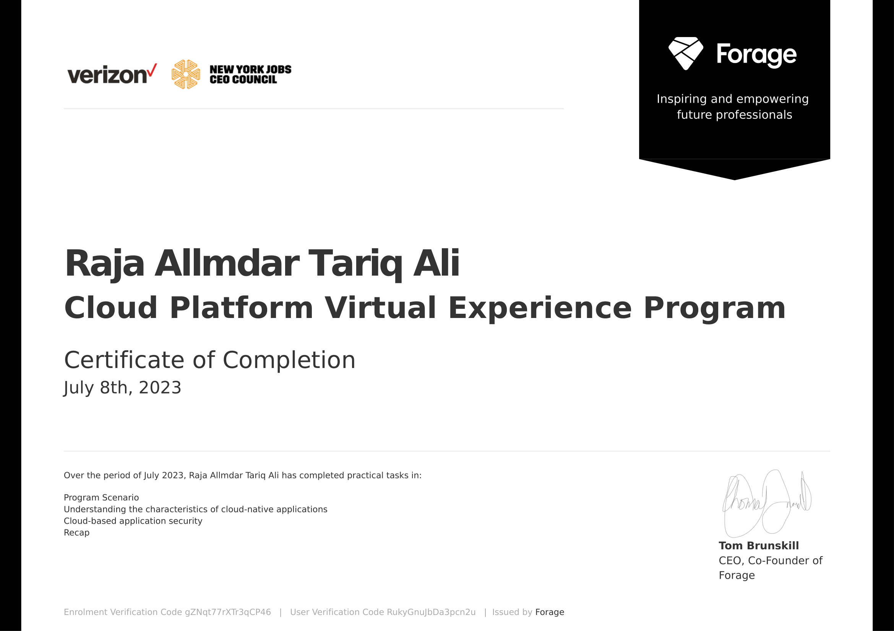

# Verizon Cloud Platform Virtual Job Simulation

This GitHub repository contains the four tasks I did through the `Verizon Cloud Platform Virtual Job Simulation` offered by Forage.

## Table of Contents

1. [Programme Duration and Role](#programme-duration-and-role)
2. [Tasks Overview](#tasks-overview)
   - [Task 1: Program Scenario](#task-1-program-scenario)
   - [Task 2: Understanding the characteristics of cloud native applications](#task-2-understanding-the-characteristics-of-cloud-native-applications)
   - [Task 3: Cloud Based Application Security](#task-3-cloud-based-application-security)
   - [Task 4: Recap and Reflection](#task-4-recap-and-reflection)
3. [Certificate of Completion](#certificate-of-completion)

## Programme Duration and Role

Over the course of `one week`, I played the role of a `Cloud Computing Engineer` at the `Verizon Cloud Computing Team.` 

This program has enabled me to immerse myself in the day-to-day operations of a CCE at Verizon, actively engage with senior team members, comprehend their objectives, and produce valuable contributions to key projects. Additionally, I've honed my understanding of `Agile methodologies`, grasped the core aspects of `cloud-native applications`, `interacted with and tested a cloud application via Python`, and adeptly presented my findings. Moreover, I've developed a deep understanding of the **three crucial elements of cloud application security** - network, application, and data, while enhancing my ability to conduct technical research, compile insightful findings, and create impactful PowerPoint presentations.

## Tasks Overview

### Task 1: Program Scenario

**Objective:** Thoroughly review existing product documentation and past sprint notes to gain a comprehensive understanding of the Sasha project, preparing for effective collaboration in sprint meetings and subsequent project tasks as a Cloud Computing Engineer at Verizon.

**What I learned in this task:**
- Gained an understanding of the Sasha project, its business requirements, and its role as a VPN service supporting Verizon Cloud Platform.
- Understood my responsibilities as a Cloud Computing Engineer at Verizon, including QA/testing support, maintaining test environments, and developing both manual and automated test cases.
- Learned about the Agile workflow at Verizon, preparing for stand-up and sprint planning meetings, and the importance of effective communication with both team members and external stakeholders.

ps. There was no deliverable for this task, only a set of questions and quizzes to guide my thought process.

### Task 2: Understanding the characteristics of cloud native applications

**Objective:** 

**What I learned in this task:**

### Task 3: Cloud Based Application Security

**Objective:** 

**What I learned in this task:**

### Task 4: Recap and Reflection

**Objective:** 

**What I learned in this task:**

## Certificate of Completion
